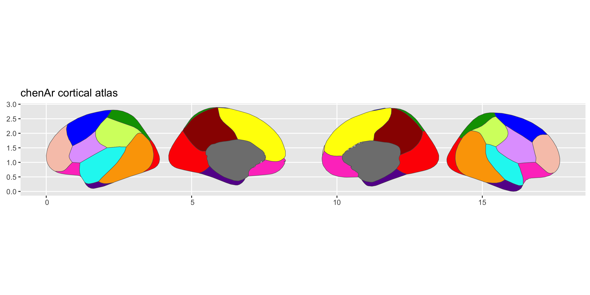
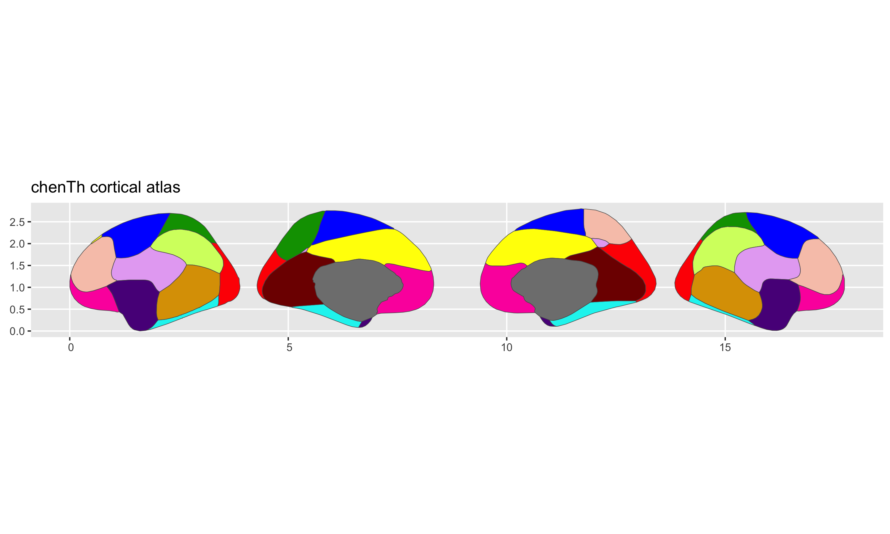

<!-- README.md is generated from README.qmd. Please edit that file -->

# ggsegChen 

<!-- badges: start -->

[](https://github.com/ggsegverse/ggsegChen/actions/workflows/R-CMD-check.yaml)
[](https://ggseg.r-universe.dev/ggsegChen)
<!-- badges: end -->

This package contains dataset for plotting the Chen thickness and areal
cortical atlas with ggseg.

Chen CH, Gutierrez ED, Thompson W, Panizzon MS, Jernigan TL, Eyler LT, …
& Dale AM (2012). Hierarchical genetic organization of human cortical
surface area. *Science*, 335(6076), 1634-1636.

## Installation

We recommend installing the ggseg-atlases through the ggseg
[r-universe](https://ggseg.r-universe.dev/ui#builds):

``` r
options(repos = c(
  ggseg = "https://ggseg.r-universe.dev",
  CRAN = "https://cloud.r-project.org"
))

install.packages("ggsegChen")
```

You can install this package from [GitHub](https://github.com/) with:

``` r
# install.packages("pak")
pak::pak("ggsegverse/ggsegChen")
```

## Areal atlas

``` r
library(ggseg)
library(ggsegChen)

plot(chenAr())
```



## Thickness atlas

``` r
plot(chenTh())
```



## Data source

Chen CH, Gutierrez ED, Thompson W, Panizzon MS, Jernigan TL, Eyler LT, …
& Dale AM (2012). Hierarchical genetic organization of human cortical
surface area. *Science*, 335(6076), 1634-1636.
