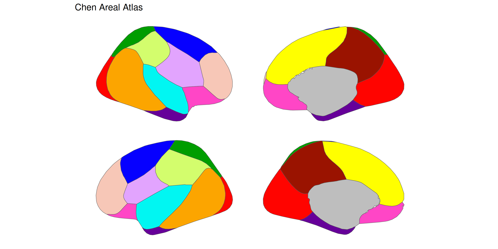
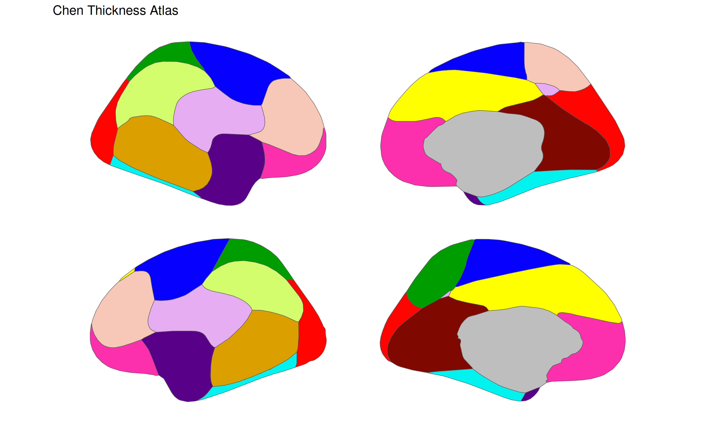

<!-- README.md is generated from README.qmd. Please edit that file -->

# ggsegChen 

<!-- badges: start -->

[](https://zenodo.org/badge/latestdoi/250277410)
[](https://github.com/ggseg/ggsegChen/actions/workflows/R-CMD-check.yaml)
<!-- badges: end -->

This package contains dataset for plotting the Chen thickness and areal
cortical atlas with ggseg and ggseg3d.

Chen et al. (2013) PNAS, 110 (42) 17089-17094;
[pubmed](https://doi.org/10.1073/pnas.1308091110)

To learn how to use these atlases, please look at the documentation for
[ggseg](https://ggseg.github.io/ggseg/) and
[ggseg3d](https://ggseg.github.io/ggseg3d).

## Installation

We recommend installing the ggseg-atlases through the ggseg
[r-universe](https://ggseg.r-universe.dev/ui#builds):

``` r
options(repos = c(
  ggseg = "https://ggseg.r-universe.dev",
  CRAN = "https://cloud.r-project.org"
))

install.packages("ggsegChen")
```

You can install the released version of ggsegChen from
[GitHub](https://github.com/) with:

``` r
# install.packages("remotes")
remotes::install_github("ggseg/ggsegChen")
```

## Chen Areal Atlas

``` r
library(ggseg)
library(ggsegChen)
library(ggplot2)

ggplot() +
  geom_brain(
    atlas = chenAr(),
    mapping = aes(fill = label),
    position = position_brain(hemi ~ view),
    show.legend = FALSE
  ) +
  scale_fill_manual(values = chenAr()$palette, na.value = "grey") +
  theme_void() +
  ggtitle("Chen Areal Atlas")
```



## Chen Thickness Atlas

``` r
ggplot() +
  geom_brain(
    atlas = chenTh(),
    mapping = aes(fill = label),
    position = position_brain(hemi ~ view),
    show.legend = FALSE
  ) +
  scale_fill_manual(values = chenTh()$palette, na.value = "grey") +
  theme_void() +
  ggtitle("Chen Thickness Atlas")
```



Please note that the ‘ggsegChen’ project is released with a [Contributor
Code of Conduct](CODE_OF_CONDUCT.md). By contributing to this project,
you agree to abide by its terms.
